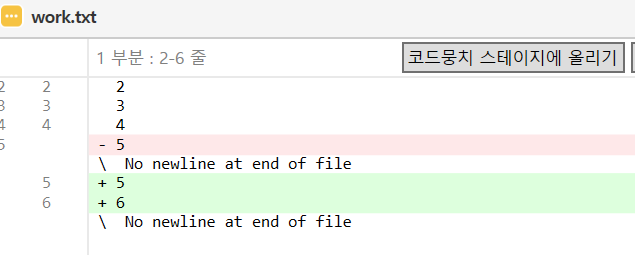
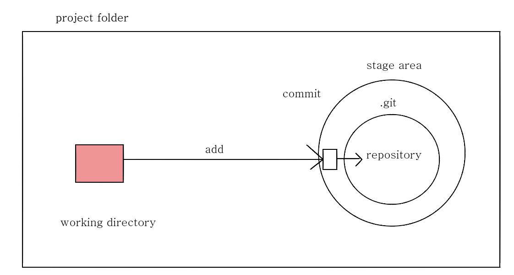
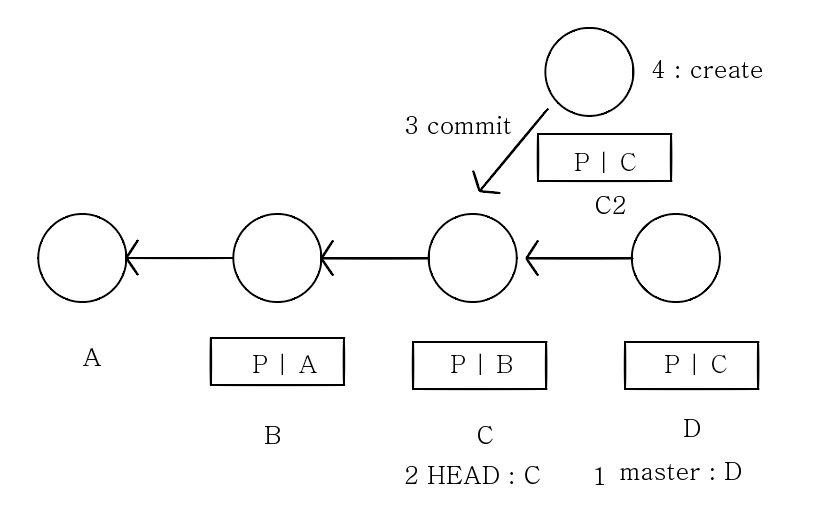
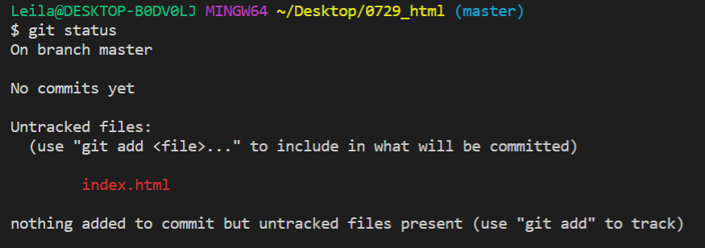
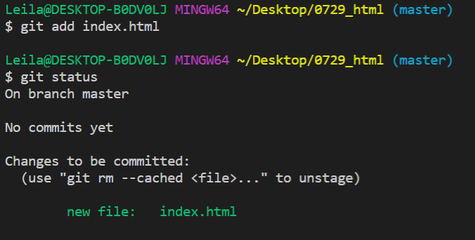

# Git / GitHub 1 - 이고잉

## 시작하기 전에

(순서대로 설치. 동시에 설치하지X.)

https://git-scm.com/<br>
https://www.sourcetreeapp.com/<br>
https://code.visualstudio.com/ (설치 후 에디터를 다시 시작) <br><br>
공부 = 나의 문제 * 상상력 > 공부의 어려움 ? 구원 : 지옥(ㅋㅋㅋㅋㅋㅋㅋㅋㅋㅋㅋㅋㅋㅋㅋㅋㅋㅋㅋㅋㅋㅋㅋㅋㅋㅋㅋㅋㅋ) <br><br>
* 화면 분할 -> 윈도우 키 + 화살표 키
* .git 폴더가 굉장히 중요하다. 해당 폴더 복붙하여 다른 디스크에 옮기면 백업이 가능하다.

<hr>

## 버전 만들기
버전이란 ? 워킹카피의 스냅샷 (≒커밋)<br><br>

### 1. Repository 만들기<br>
원하는 위치에 폴더 생성 - 소스트리 프로그램 시작 - Newtab - create - 방금 만든 폴더 선택 - 예 (이미 있는 폴더라고 하니까 맞다 라고 Yes 선택)

### 2. Commit 하기<br>
파일을 만든 후 스테이지에 파일을 올리고 아래 커밋버튼을 누르기 전 message를 입력! 커밋 누르고 나면 화면이 clear 된다. (파일이 없어진 것이 아닙니다)

### 3. 1개의 파일, 그 파일의 변경된 부분을 저장하기 <br>
2번과 똑같이 진행 후 history 를 확인하면 <br><br>
 <br>
왼쪽 아래 창에서 위와 같은 화면을 확인할 수 있다.
여기서 -5와 +5는 두개 합쳐서 그대로니까 변함 없고 6만 추가되었다 라는 의미이다. <br><br>
+ git 구조 <br>

<br><br>


### 4. 새 버전 만들기를 까먹었을 때
* 스테이지 : 하나로 묶일, 한 버전으로 만들어질 파일을 올리는 곳 <br><br>
스테이지로 올라간 파일들은 한 번에 한 버전으로 올려질 파일들이고 올라가지 않은 파일들은 올리기 전까지 커밋되지 않는, 변경된 부분이 있는 파일들이다. <br><br>
따라서 위의 경우 한 버전으로 올릴 것들을 먼저 스테이지에 올리고 커밋한다. 이후 다음 버전으로 만들 파일들을 스테이지에 올리고 커밋!


<hr>

## HEAD 

### 1. 소스트리를 이용한 시간 여행 
MASTER : 나의 마지막 커밋을 가리킨다 <br><br>
HEAD : __나의 워킹카피(= 로컬 저장소)가 어느 버전에서 유래했는가__ 를 나타낸다. history 에서 왼쪽 빈 동그라미가 head의 위치.<br> 어떤 소스든 head 부터 확인하여 어느 위치를 기반으로 작성된 것인지 알아낸다. <br><br>
checkout : 헤드를 옮긴다. 다시 마스터로 옮겨주어 detached 되는 상황을 방지하는 것이 중요하다. <br><br>
detached : 헤드가 마스터를 가리키지 않고 헤드가 가리키는 버전을 기반으로 커밋이 새로 생성됨. 헤드가 마스터로부터 detached 되었다, 떨어져나왔다 라고 한다.

discard : 폐기. history 에서 작업 파일 내역을 삭제하고 싶을 때 (commit 목록이 아님) 사용한다. <br><br> commit id : 각 버전마다 커밋 아이디를 가지고 있고 맨 첫번째 버전을 제외한 나머지는 모두 parent 커밋 아이디를 저장하고 있다. <br><br>
reset : head가 가리키는 브랜치를 바꾼다 (head가 master를 가리키면 마스터를 바꾼다)

* 맨 처음 작업한 work 1으로 돌아가고 싶다면? <br>
>history에서 work1 더블클릭 혹은 오른쪽 마우스 - check out <br>

* 다시 복귀를 원한다면? <br>
> 왼쪽 master 더블클릭 - 안내메시지 Yes 버튼

* 수정하고 commit 했는데 무엇인가 잘못되었다! 이전 버전으로 돌리고 싶은데 여러 파일과 함께 저장된 파일이라 일부만 싹 없애고 싶다면? <br>
>history 누르고 아래 작업 파일 내역에서 싹 없애버릴 내역에 오른쪽 버튼 누르고 discard 선택 <br>
(remove : 아이콘만 빨간색으로 바뀌고 그대로 관리중) <br>
(파일 자체 삭제 : 소스트리 내에서 missing이라고 뜸. 재생성 가능)

* Detached 상세 설명<br>

> 위의 그림 상태 : [ 마스터 : D, 헤드 : C - 이상태에서 커밋 - 새로운 버전의 부모 : C ] > __헤드가 가리키는 위치를 부모로 하여 생성됨__ <br><br>
이 상태에서 마스터를 더블클릭 한다면 ?<br>
head 조차 C2를 가리키지 않으므로 그래프에서 나타나지 않게 됨. 삭제되는 것은 아니지만 불러오려면 커밋 아이디를 알아야 한다.<br>

* Reset 상세 설명
C2가 없고 head가 마스터를 가리킬 때, C와 D를 __지우고__ B로 돌아가고 싶다면?<br>  
> history - 커밋 목록에서 해당하는 파일 선택 - 오른쪽 버튼 - Reset current branch to this commit - using mode를 hard - 파괴적인 작업(!)을 경고하는 메세지 Yes <br>
head는 마스터를 가리키고 마스터가 B를 가리키게되어 헤드는 B의 워킹카피를 수행한다.
<hr>


참고
>https://opentutorials.org/module/3733
https://opentutorials.org/module/3747
https://opentutorials.org/module/3762
### 2. Command Line Interface 이용하기
#### 2.1 CLI 란?
Command Line Interface 의 약자 
(Interface 는 조작장치 라고 생각하면 된다) <br>
CLI : 키보드 명령 / GUI: 터치, 마우스 <br>

#### 2.2 Git 사용을 위한 터미널 열기
VS code 프로그램 열기 - 작업 원하는 폴더를 Open - ctrl+ 알파벳 'j' - View 탭 - Command Palette - Terminal : Select default Shell - git bash - 아래 터미널 창의 ' + ' 버튼 클릭

#### 2.3 Git 명령어
* git init - .git 이라는 폴더를 생성했다고 말함. 소스트리에서 create와 같음
* ls - 내가 있는 곳에 어떤 파일들이 있는지 출력 <br>
옵션 추가 ;  ls -l : 상세보기 / ls -l -a 혹은 ls -al: 숨김파일 포함 상세보기
(drwxr-xr-x 1 ; 맨 앞글자 d - directory)
* pwd - 현재 위치
* git내 pwd에 해당하는 것 - git status <br>

빨간색 글자 파일 : Stage area로 올려야한다는 뜻. html 파일을 추가해야 track 할 수 있다는 의미. add 가 필요하다.
* git add index.html - git status <br>

새로운 파일은 찾았지만 아직 커밋 되진 않음. 스테이지에 올라가긴 한 상태. add라는 것 자체가 track및 스테이지 올리는 작업. 두 작업을 모두 수행하는 명령어
* git commit -m “work 1” - work 1 이라는 메시지(-m 옵션)를 가진 버전 생성. 
* git diff - 이 전의 입력과의 차이점을 출력함. 변경 후 commit 하기 전에 확인 할 수 있다.
* git commit 목록(history) 확인 - git log : 마지막 커서에  ‘:’ 가 출력될 경우 아래 창이 작아서 생략된 것. 화살표 (↓) 누르고 생략 목록까지 전부 확인한다. 출력이 완료되면 q를 누르고 빠져나간다 <br>
옵션 추가 ; git log --oneline : 한 줄로 log를 나타내라!
* 여러개를 add 할 경우 - git add index.html index2.html (파일 두 개 사이에 공백 한 번)/ git add index.html 엔터 후 git add index2.html. 두 가지 모두 사용 가능
* head 변경 - git checkout  8aaa0f7 (->변경하려는 커밋 아이디)
* head log 만 확인 - git log --oneline<br>
master , head 모두 확인 - git log --oneline --all
* git checkout master ; 마스터로 head 다시 복귀
* git reset --hard 8aaa0f7 (변경하려는 커밋 아이디) : 해당 커밋 아이디로 head가 reset된다. 그 이후 커밋이 있다면 해당 커밋은 삭제 즉, detached 된다.
* git reflog - 노란색 글씨 : 헤드가 가리키게 된 커밋아이디 결과 / 반대쪽 : 원인 <br> 돌아가고 싶을 때의 시점과 커밋 아이디를 찾을 수 있다.
(찾아서 reset하면 복원 가능)
* detached 되어 사라졌던 커밋 되살리기 : git reset --hard (삭제된 commit 아이디). > 깃은 아무것도 안지운다. ~~아주 기만적인 놈.~~ 실제로 지우기 위해서는 해당이름과 같은 것으로 덮어쓰기를 해야 사라진다.

### 3. HTML 맛보기

* html 파일 크롬에서 열기<br>
a. 폴더에 html 파일 만들기<br>
b. C:/Users/Leila/Desktop/0729_html/index.html 를 주소창에 입력!
```html
* 글자 아래에 밑줄 만들기 - 글자를 <u> </u> 태그의 사이에 넣기 
* 이탤릭체 - <i> </i>
* 줄바꿈 - <br> ‘/’ 를 쓰지 않는다. 시작-끝 이 페어로 필요한 태그가 ‘/’를 사용한다.
* 목록 만들기 - <li> </li>
* 서로 연관된 목록 grouping - <ul></ul> 한 목록으로 나타낼 목록의 전체를 해당 태그로 감싼다. - 구분 지어주는 것이기 때문에 ul 태그 아래에는 자식 태그인 li가 있다.
* 숫자로 된 목록 만들기 - <ol> </ol> 자동으로 1부터 인덱스를 나타내줌 (ul 태그 대신 사용)
```
