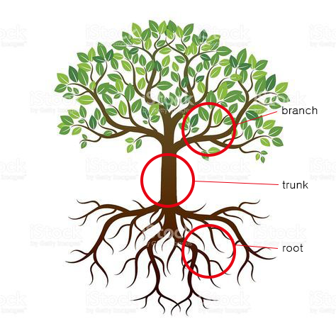

# Git / GitHub 2 - 이고잉

### 개발 관련 상식
git cheat sheet : 명령어가 정리된 목록  
  
IDE : Integrated Development Environment   
효율적으로 소프트웨어를 개발하기 위한 통합개발환경 소프트웨어 어플리케이션 인터페이스  
emulator : window 위에서 unix 계열 명령어가 작동하도록 만들어 줌.  ex) ls 입력 - emulator 해석 - window로 dir 명령어임을 알려준다.  
window 계열 명령어와 Unix 계열 (Linux 포함) : 명령어의 차이가 있음 ex) window : Unix - dir : ls.  

## Git 명령어
* mkdir 폴더이름 : make directory. 해당 위치 내 폴더 만들기. ex) mkdir hello-dir
* cd : 현재 위치 변경
* 상위 폴더로 현재 위치 변경 :   1) cd .. : 부모 디렉토리로 위치 변경 (상대경로). 따라서 cd ../../ : 부모의 부모   2) cd 절대경로 : 해당 경로로 위치 변경 (절대경로 : pwd 입력하면 나오는 경로)
* 하위 폴더로 현재 위치 변경 : cd 폴더이름 혹은 cd ./폴더이름 (./는 생략 가능. 다른 명령어에서도 동일 적용)
* VS code ' + ' 버튼 : 현재 작업 디렉토리로 새로운 터미널 생성. 다시 원래 위치로 돌아올 때 쓰면 편하다.
* rm : 삭제  1) 파일 삭제 : rm 파일 이름   2) 폴더 삭제 : rm -r 폴더이름. -r이 아닌 -rf 하게 되면 경고 메세지 없이 강제 삭제
* git add ./ : 모든 변경사항 Stage area로 올린다.(
./ - 현재 디렉토리 , /. - 루트 디렉토리)
* git commit -a -m "work 2" = git commit -am "work 2" : stage area 에 add한 뒤에 work 2라는 메세지로 커밋. add와 commit을 동시에 할 수 있다. 아예 untracked 된 파일은 사용할 수 없다. modified 된 파일에 대해서만 가능하다. (만약 modified 된 파일과 untracked 된 파일 두 개를 한 번에 commit -am 하게 되면 modified된 파일만 commit 되고 untracked 파일은 스테이지에 올려지지 않은 상태로 남아있다.)
* 버전 관리에 포함되지 않고 status에 나타나지 않기를 원할 때 (ex) password.txt 파일이 해당 폴더 내에는 있어야 하지만 업로드되면 안될 때) : .gitegnore 파일 만들고 해당 파일 내에 해당 파일 이름과 확장자를 적는다. 그러면 해당 파일은 회색처리되고 (죽여버렸다!) commit 하게 되면 .gitignore 파일만 올라간다 !!!! (ex) .gitignore 파일에 password.txt 라고 입력. 이후 commit!! password.txt 파일을 변경해도 상관없다! txt파일은 커밋되지 않음! 꺄오!)
* Ctrl + C : 취소. (뭔가 문제가 생기면 눌러보자ㅎ)
* .tmplate : 형식만 가지고 있는 파일. 다른 컴퓨터에서 세팅할 때 이용. 이건 커밋 해두고 나중에 이용할 때 ignore에 추가하여 사용할 수 있다.

## Branch

### 왜 Branch를 쓸까?
어떤 시점에서 내가 원하는 실험을 하고 싶을 수 있다. 과연 이게 될까 안될까 하며 실험을 수행하다가 만약 잘 되지 않았을 경우 다시 원래대로 돌아오고 싶다면, Branch를 미리 만들어 두고 head를 옮기면서 실험과 원상복귀를 할 수 있다.

### branch를 만들기 전에! 복습!  
* 항상 status 확인 먼저!!!- 내 워킹카피가 어디서 유래했는지 보기 위해서!  
* checkout : head를 바꾼다
* reset : head가 가리키는 branch를 바꾼다

### Branch 시작하기

* git branch : branch 리스트
* git branch exp : exp 라는 이름을 가진 branch 생성
* exp에 checkout 되어 있다 
* terminal 에서 그래프로 확인하기 : git log --oneline --all  --graph
* git branch -d exp2 : exp2라는 이름의 branch 삭제. head가 exp2가 아닌 곳에 위치해있어야함.but merge되지 않은 경우 지워지지 않는다.
* git branch -D exp2 : merge되지도 않았지만 필요없어져 삭제할 때, -d 대신 -D로 삭제를 수행할 수 있다.

* git commit -a (enter): -m의 경우 짧은 메세지 입력만 가능하지만 -a의 경우 vs code 파일이 뜨면서 거기에 길게 만들 수 있도록 나온다.
* git checkout -b exp : exp라는 branch를 만들고 해당 위치로 head를 checkout 한다.

* git default editor vscode 
* 병합 : 마스터를 최신으로 옮긴다! (ex) 마스터로 exp를 병합)  a. 먼저 마스터로 checkout - git checkout master  b. 마스터에서 merge 한다. - git merge exp 
; 이 경우 자동으로 merge 했다 라는 commit이 생성됨 
---> 수동이였다면 해당 내용을 복사하여 기존 파일에 붙여넣기하여 commit 했을 것. 
    * '주류'로 원하는 위치의 branch에 head를 놓고 merge 수행. ex) 마스터 branch에 exp를 합치고 싶을 때 : head를 마스터로 옮기고 오른쪽 branch리스트에서 exp 누르고 오른쪽 버튼 - merge exp into current branch
    * 다시 branch를 나누고 싶을 때 : reset을 통해 위치 변경 
    * 만약 이름이 같은 한 파일 안에 서로 다른 수정이 발생하여 병합 충돌이 발생한다면? (두 사람이 같은 하나의 파일을 수정한 경우)   (ex)base 파일을 바탕으로 master branch와 exp branch, 총 2개의 branch의 상황) :   base 파일을 기준으로 어느 한 쪽이 수정한 사항이라고 여겨지는 것은 반영한다. 둘 다 수정한 부분이라고 생각되는 것은 coflict가 발생한 것으로 간주한다.    conflict 가 발생하면 아래와 비슷한 그림으로 사용자에게 알려준다.      뜻 : m2와 e2가 같은 위치예요! 뭘 선택해야할 지 몰라요!  
    해결 : 어떤 것을 선택할 지 정해서 저거 다 지우고 (사용자에게 알려주기위한 설명이므로) 수정 후 resolve conflicts - mark resolved (terminal에서 : git status 보면 Unmerged paths 로 파일에 문제가 있음이 나옴. git add 를 통해 수정된 파일을 다시 stage에 올린다)

    * 병합 취소 : git merge --abort

* add의 3가지 기능 : Stage area로 올린다, Untracked를 tracked로 바꾼다, 충돌 해결을 알려준다.(충돌 해결 이후 stgae area로 올라간 상태로 변경됨)

* 이미 터미널로 작업 하던 것을 소스트리로 확인하기 위해서는 create 가 아닌 add 로 새 탭을 추가한다.

* (Head, Exp) vs (Head->Exp) : 앞 경우는 head와 exp 둘다 해당 커밋을 가리키고 있을 때이고 뒤의 경우는 Head가 exp를 가리키고 있는 경우 이다.

> 참고 :  
https://opentutorials.org/module/3927 
https://qvil.github.io/git/gitconfig-editor-mac/
https://www.git-tower.com/blog/git-cheat-sheet/
