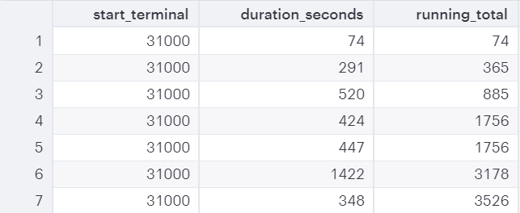
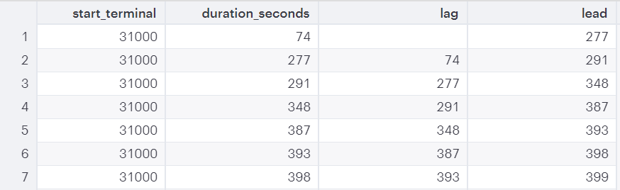

## 2019-11-25 Window Function & SQL
### Basic Window Function

* 지원 서버
    * Hive - 대용량 분산처리 DB
    * Presto - Hive와 비슷한 계열 (Amazon Redshift, Oracle 등 지원)
    * PostgreSQL 
    * MySQL은 지원하지 않는다 !!!

* AGGREGATE - SUM, COUNT, MAX, MIN, AVG

```sql
-- 1
SELECT start_terminal,
       duration_seconds,
       SUM(duration_seconds) OVER
         (PARTITION BY start_terminal) AS start_terminal_total
  FROM tutorial.dc_bikeshare_q1_2012
 WHERE start_time < '2012-01-08'
```
```sql
-- 2
SELECT start_terminal,
       SUM(duration_seconds)
  FROM tutorial.dc_bikeshare_q1_2012
 WHERE start_time < '2012-01-08'
 Group By start_terminal
```
2 처럼 한 경우에는 스타트 터미널 하나, sum값 하나 이렇게만 나오는데 1의 경우에는 
```sql
SELECT df.duration_seconds / df.start_terminal_total
```
위와 같은 계산이 가능하도록 나타난다.

```sql
-- 3
SELECT start_terminal,
       duration_seconds,
       SUM(duration_seconds) OVER
         (PARTITION BY start_terminal ORDER BY start_time) AS running_total
  FROM tutorial.dc_bikeshare_q1_2012
 WHERE start_time < '2012-01-08'
```

위와 같이 sum 에 order by 를 추가하면 누적으로 더해준다.
만약 동시에 출발했을 경우에는 누적 합에 한 값이 아니라 여러 값이 더해진 것이 나타날 수 있다.


* RANK - RANK, DENSE_RANK, ROW_NUMBER
```sql
SELECT start_terminal,
       start_time,
       duration_seconds,
       ROW_NUMBER() OVER (ORDER BY start_time)
                    AS row_number
  FROM tutorial.dc_bikeshare_q1_2012
 WHERE start_time < '2012-01-08'
```
start_time을 기준으로 첫 번째로 출발한 사람, 두 번째로 출발한 사람.... 으로 순서를 매긴다.<br>
500번째 사람을 찾는다거나 1등이나 마지막 사람외에 중간에 껴있는 사람들의 특징을 보고싶을 때 유용<br>

하지만 시간이 정확이 일치하면 등수를 어떻게 매겨야 할까?<br>
row number의 경우에는 어떻게든 numbering을 한다.<br>
하지만 같은 시간일 때 Rank는 같은 등수를 부여한다. (4등이 두 명인 경우 다음 rank 번호는 6이 된다.)<br>
DENSE_RANK의 경우에는 같은 등수를 부여하고 다음 번호에 무조건 +1을 한다. (4등이 두명인 경우에도 다음 rank 번호는 5이다.)
```sql
SELECT start_terminal,
       duration_seconds,
       RANK() OVER (PARTITION BY start_terminal
                    ORDER BY start_time)
              AS rank
  FROM tutorial.dc_bikeshare_q1_2012
 WHERE start_time < '2012-01-08'
```

* 그룹 내 비율 관련 함수 - CUME_DIST, PERCENT_RANK, NTILE, RATIO_TO_REPORT
```sql
SELECT start_terminal,
       duration_seconds, 
       NTILE(4) OVER  
         (PARTITION BY start_terminal ORDER BY duration_seconds)
          AS quartile,
       NTILE(5) OVER
         (PARTITION BY start_terminal ORDER BY duration_seconds)
         AS quintile,
       NTILE(100) OVER
         (PARTITION BY start_terminal ORDER BY duration_seconds)
         AS percentile
  FROM tutorial.dc_bikeshare_q1_2012
 WHERE start_time < '2012-01-08'
 ORDER BY start_terminal, duration_seconds
```
NTILE(4) : 같은 start_terminal 안에서 duration_seconds를 기준으로 4개로 쪼갠다<br>
NTILE(100) : 만약 같은 start_terminal 안의 데이터가 100개가 넘지 않으면 numbering을 하다가 그냥 다음으로 넘어간다. <br> 각 start_terminal의 데이터가 16개씩밖에 없다면 1-16까지 numbering하고 다음 strat_terminal로 넘어가면 그냥 다시 리셋되고 1-16을 numbering한다.

* 순서 관련 함수 (Oracle만 지원)
```sql
SELECT start_terminal,
       duration_seconds,
       LAG(duration_seconds, 1) OVER
         (PARTITION BY start_terminal ORDER BY duration_seconds) AS lag,
       LEAD(duration_seconds, 1) OVER
         (PARTITION BY start_terminal ORDER BY duration_seconds) AS lead
  FROM tutorial.dc_bikeshare_q1_2012
 WHERE start_time < '2012-01-08'
 ORDER BY start_terminal, duration_seconds
```


LAG : 한 개 앞의 데이터를 가져온다. 첫 번째 데이터의 경우에는 빈칸
LEAD : 한 개 뒤의 데이터를 가져온다.
LAG(duration_seconds, 7) : 시간 순서로 되어있다면 일주일 뒤의 데이터를 확인할 수 있다.

* Window clause - 모든 서버가 지원하는 것은 아니다.
```sql
SELECT start_terminal,
       duration_seconds,
       NTILE(4) OVER ntile_window AS quartile,
       NTILE(5) OVER ntile_window AS quintile,
       NTILE(100) OVER ntile_window AS percentile
  FROM tutorial.dc_bikeshare_q1_2012
 WHERE start_time < '2012-01-08'
WINDOW ntile_window AS
         (PARTITION BY start_terminal ORDER BY duration_seconds)
 ORDER BY start_terminal, duration_seconds
```

참고 : SQL은 어떻게든 돌아간다. 오류를 잘 나타내지 않으므로 숫자가 나온다고 바로 보고하기 보다는 확실히 체크한 뒤에 보고하도록 하자!!!

---

### Reference
#### SQL Window Function
• 영어자료: https://mode.com/sql-tutorial/sql-window-functions
• 한국어자료: http://www.gurubee.net/lecture/2382 (edited) 